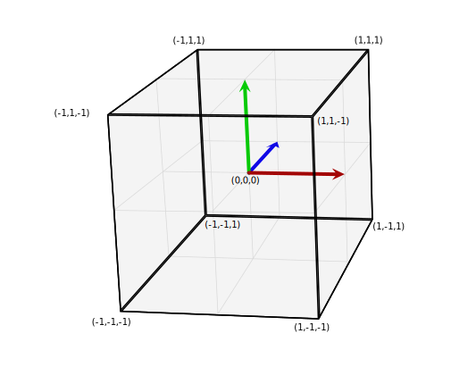

# WebGL introduction

WebGL is an API based on OpenGL for rendering 2D and 3D graphics in a web browser. It is fully integrated with other web standards by major browser vendors and runs in the HTML5 canvas element. WebGL programs are written in JavaScript and GLSL (OpenGL Shading Language), a language similar to C or C++, and are executed on a computer's GPU.

Essentially, the code provided to run on a GPU needs to be supplied through a program, which is a form of pair functions, called a vertex shader and a fragment shader. A vertex shader's job is to compute vertex positions, so that WebGL can then rasterize using various kinds of primities such as points, lines or triangles. At the point of the rasterization, a fragment shader is called to compute a color for each pixel of the primitive currently being drawn.

The view projection of WebGL's result is compressed down into a 2D space and rasterized into an interactive image object. This object is based in a clip space, a special coordinate system in which GPU computes all transformations. The clip space coordinates always range from -1 to +1 independently on size of the canvas.

> 
>
> ***Clip space***
>
> *Source: MDN Web Docs ([link][R003])*


To get a better understanding and demonstrate all previously mentioned concepts in practice, let's try creating a simple triangle. This assumes a basic knowledge of HTML, CSS and JavaScript.

1) WebGL object lives in a standard HTML5 [canvas element](https://developer.mozilla.org/en-US/docs/Web/HTML/Element/canvas):

    ```html
    <canvas id="canvas"></canvas>
    ```

2) The target element is then referenced in JavaScript:

    ```js
    const canvas = document.getElementById("canvas");
    ```

3) The element's context is required next to describe the target onto which the drawing will be rendered:

    ```js
    const gl = canvas.getContext("webgl2");
    ```
    
    The `webgl2` is one of many context types that specify which object type will be created. In this case, `webgl2` will create a [`WebGL2RenderingContext`](https://developer.mozilla.org/en-US/docs/Web/API/WebGL2RenderingContext) object representing a 3D rendering context supported by browsers with WebGL version 2 implementation.

4) Define vertex and fragment shaders:
    ```js
    const vertexShaderSource = `#version 300 es

    in vec4 a_position;

    void main() {
        gl_Position = a_position;
    }
    `;

    const fragmentShaderSource = `#version 300 es
 
    precision highp float;
    out vec4 outColor;
    
    void main() {
        outColor = vec4(1, 0, 0.5, 1);
    }
    `;
    ```

    As described before, shaders are written in GLSL. Passing them in JS template strings is one of a few available options. The details of this shader definition are described in future posts.

5) A function to create a shader, upload the GLSL source and compile the shader is required next:

    ```js
    const createShader = (gl, type, source) => {
        const shader = gl.createShader(type);
        gl.shaderSource(shader, source);
        gl.compileShader(shader);

        const success = gl.getShaderParameter(shader, gl.COMPILE_STATUS);
        if (success) {
            return shader;
        }

        gl.deleteShader(shader);
    };
    ```

6) We can now call that function, create the pair shaders, link them into a program and call it:

    ```js
    const vertexShader = createShader(gl, gl.VERTEX_SHADER, vertexShaderSource);
    const fragmentShader = createShader(gl, gl.FRAGMENT_SHADER, fragmentShaderSource);

    const createProgram = (gl, vertexShader, fragmentShader) => {
        const program = gl.createProgram();
        gl.attachShader(program, vertexShader);
        gl.attachShader(program, fragmentShader);
        gl.linkProgram(program);

        const success = gl.getProgramParameter(program, gl.LINK_STATUS);
        if (success) {
            return program;
        }

        gl.deleteProgram(program);
    };

    const program = createProgram(gl, vertexShader, fragmentShader);
    ```

7) A GLSL program is now created on the GPU and we need to supply data to it. In this case, our only input will be `a_position`.

    ```js
    const positionAttributeLocation = gl.getAttribLocation(program, "a_position");
    const positionBuffer = gl.createBuffer();
    gl.bindBuffer(gl.ARRAY_BUFFER, positionBuffer);
    ```
    
    Nearly all of the entire WebGL API is about setting up state to supply data into GLSL programs. There are multiple ways how shader can receive data and they will be explored more deeply in one of the following posts. 

    Our `a_position` input is an *attribute*. We need to look up the location of this attribute first with `getAttribLocation()`. Since attributes get their data from *buffers*, we need to create one with `createBuffer()`. We can also bind this position buffer with `bindBuffer()` to a bind point, by which the resource can be referred.

8) Finally, it is time to put data into the buffer through the bind point:

    ```js
    const positions = [
        0, 0,
        0, 0.5,
        0.7, 0,
    ];
    gl.bufferData(gl.ARRAY_BUFFER, new Float32Array(positions), gl.STATIC_DRAW);
    ```

    WebGL needs strongly typed data, which fortunately can be defined in JS array first and its valued then copied to a new array of 32bit floating point numbers. Thanks to `bufferData()`, the data are copied to the `positionBuffer` on the GPU after.

    `gl.STATIC_DRAW` is a hint to WebGL about how the data will be used, which can result in better optimization.

9) Our data are in a buffer and the attribute needs to know how to get it out:

    ```js
    const vao = gl.createVertexArray();
    gl.bindVertexAray(vao);
    gl.enableVertexAttribArray(positionAttributeLocation);

    const size = 2;
    const type = gl.FLOAT;
    const normalize = false;
    const stride = 0;
    const offset = 0;
    gl.vertexAttribPointer(positionAttributeLocation, size, type, normalize, stride, offset);
    ```

    First a collection of attribute state called Vertex Array Object (VAO) needs to be created and set as the current vertex array so that all attribute settings will apply to it. In order to tell WebGL to get data out of a buffer, the attribute needs to be turned on with `enableVertexAttribArray()`. Without this step being done the attribute would have a constant value. 

    The attribute is then bound to `positionBuffer` using various parameters:

    - `size`: how many components per iteration
    - `type`: type of data
    - `normalize`: boolean for data normalization
    - `stride`: how much to move each iteration
    - `offset`: position at initialization

10) WebGL also need to know how to convert from the clip space value back into pixels (also called screen space) and how to display the canvas:

    ```js
    gl.viewport(0, 0, gl.canvas.width, gl.canvas.height);

    gl.clearColor(0, 0, 0, 0);
    gl.clear(gl.COLOR_BUFFER_BIT);
    ```

    The `<-1, 1>` clip space is mapped to `<0, gl.canvas.width>` for the x axis and `<0, gl.canvas.height>` for the y axis. The canvas is made transpared by setting its red, green, blue and aplha channels to zero.

11) Finally, we can instruct WebGL which shader program to execute, which set of buffers to user and how to pull data out of those buffers to supply to attributes, and exacute our GLSL program:

    ```js
    gl.useProgram(program);
    gl.bindVertexArray(vao);

    const primitiveTypes = gl.TRIANGLES;
    const execOffset = 0;
    const execCount = 3;
    gl.drawArrays(primitiveType, offset, count);
    ```

    The count is 3 and therefore it will execute the vertex shader 3 times. Each time, `a_position.x` and `a_position.y` will be set to 2 values from the `positionBuffer`. WebGL will draw a triangle base on these 3 values. For every pixel it is about to draw, a fragment shader will be called and its color will be computed.

Finally we get our tringle. The whole source code can be found in [`src/triangle`](src/triangle) folder or viewed live on [Codepen](https://codepen.io/bartosjiri/pen/ExVqowj).

> 
>
> ***WebGL triangle example***
>
> *Source: WebGL2 Fundamentals ([link][R001])*

As demonstrated, quite a lot of code is required in order to draw a single shape. It can seem complicated because of a vertex and fragment shader, however these run on the GPU which is also where all the speed comes from. Fortunately, compiling and linking shaders is most of the time same in every WebGL program and therefore a boilerplate code can be used. There is also plenty of [frameworks and libraries](https://gist.github.com/dmnsgn/76878ba6903cf15789b712464875cfdc).


---

## Resources
| Title | Author | Link |
| :---   | :---  | :---  |
| WebGL2 Fundamentals | [Greggman](https://github.com/greggman) | [Link][R001] |
| Getting Started | [WebGL Public Wiki](https://www.khronos.org/webgl/wiki/) | [Link][R002] |
| WebGL model view projection | [MDN Web Docs](https://developer.mozilla.org) | [Link][R003] |


[R001]: https://webgl2fundamentals.org/webgl/lessons/webgl-fundamentals.html
[R002]: https://www.khronos.org/webgl/wiki/Getting_Started
[R003]: https://developer.mozilla.org/en-US/docs/Web/API/WebGL_API/WebGL_model_view_projection
