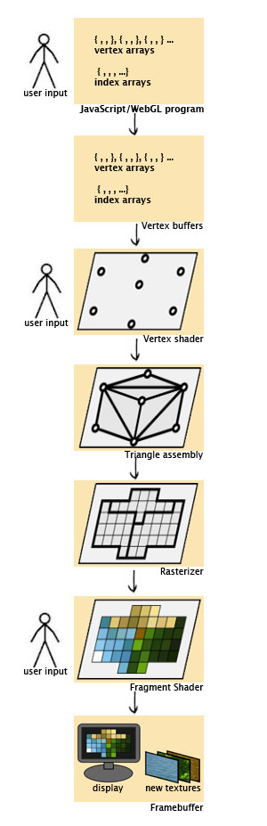
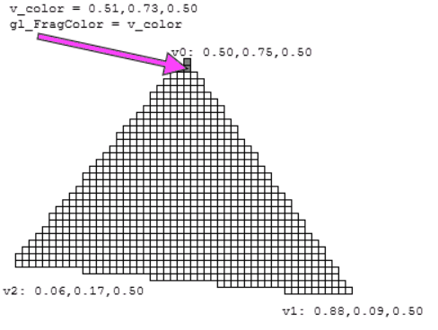

# Under the hood

WebGL is slightly more complicated than typical web tech since it is designed to work directly with the GPU. Eventhough it was purposely left very low-level, allowing it to rapidly do complex rendering, essentially it is still just a set of JavaScript functions which wrap around the OpenGL ES specification. 

There are several [frameworks and libraries](https://gist.github.com/dmnsgn/76878ba6903cf15789b712464875cfdc) available, hiding away some of the core complexities, making it accessible to more people as well as saving time on boilerplate code.
However, even a basic understanding of how WebGL works under the hood can be useful to find your way around problems and solutions in your projects.

The process of generating an WebGL image is following:

1) The JavaScript code gets a specified context from a HTML5 canvas element.

2) A set of shaders written in GLSL is registered. This specifies where and how elements will be created, how they will look etc.

3) The rest of information about our graphics is then fed into the graphics pipeline, processed and rendered. There is a lot of action condensed in this step, so let's take a closer look at it.

> 
>
> ***Rendering pipeline***
>
> *Source: Luz Caballero ([link][R002])*

We are starting with our data created in JavaScript in one or more ways. It can be a 3D model file, procedurally created data or instructions used through libraries. All of these include model vertices defining location, normal vectors defining direction, and color data. This is put into vertex arrays that contain vertex attributes like the location of the vertex in space and information about texture, color and lighting features (vertex normal). Such vertex arrays are sent to GPU in a set of vertex buffers.

Once inside the GPU, it selects each vertex out of the vertex buffer and runs it through the vertex shader. As a result we receive a mesh coordinates. Usually, the process performed on the vertex shader looks similar to this:

  ```js
  gl_Position = PROJECTION_MATRIX * VIEW_MATRIX * MODEL_MATRIX * VERTEX_POSITION
  ```

  - `PROJECT_MATRIX`: camera's lens representation
  - `VIEW_MATRIX`: a 4x4 matrix representing camera's view
  - `MODEL_MATRIX`: a 4x4 matrix which transforms object-space coordinates (= coordinates before translations) into world-space coordinates 
  - `VERTEX_POSITION`: a 4D vector (x, y, z, w)

As `gl_Position` provides clip coordinates, WebGL will divide the result by `gl_Position.w`, producing normalized device coordinates. These coordinates are then translated into space coordinates to connect verteces and display individual pixels in specified viewport. In other words, the 3D world is being projected onto a 2D viewing screen. As last step for the vertex shader, everything that is not in the camera's field of view is clipped away.

The generated object coordinates are mapped into pixel-sized fragments and passed through the fragment shader. The shader is called for each individual pixel to calculate its actual color and depth values. This can be done in various ways, ranging from hard-coding a specific color, through color interpolation and texture lookups, to more advanced mappings.

> 
>
> ***Fragment shader & color interpolation***
>
> *Source: WebGL2 Fundamentals ([link][R001])*

These values are put into the framebuffer. This is where pixels are filtered by their depth, meaning that depth of pixels relative to the camera is compared and all pixels that are hidden behind others will be either combined or discarded. Finally, as a result of all of this, the complete view can be drawn.

---

## Resources
| Title | Author | Link |
| :---   | :---  | :---  |
| WebGL How It Works | [Greggman][A001] | [Link][L001] |
| An Introduction to WebGL — Part 1 | [Luz Caballero][A004] | [Link][L004] |
| An intro to modern OpenGL. Chapter 1: The Graphics Pipeline | [Joe Groff][A005] | [Link][L005] |
| 3D Computer Graphics - What and How | [Dr. Wayne Brown][A006] | [Link][L006] |
| How WebGL works? | [sinisterchipmunk][E002] | [Link][E001] |


<!-- Resource links -->
[L001]: https://webgl2fundamentals.org/webgl/lessons/webgl-how-it-works.html (WebGL How It Works)
[A001]: https://github.com/greggman (Greggman)
[L004]: https://dev.opera.com/articles/introduction-to-webgl-part-1/ (An Introduction to WebGL — Part 1)
[A004]: https://dev.opera.com/authors/luz-caballero/ (Luz Caballero)
[L005]: http://duriansoftware.com/joe/An-intro-to-modern-OpenGL.-Chapter-1:-The-Graphics-Pipeline.html (An intro to modern OpenGL. Chapter 1: The Graphics Pipeline)
[A005]: https://twitter.com/jckarter/ (Joe Groff)
[L006]: http://learnwebgl.brown37.net/the_big_picture/3d_rendering.html (3D Computer Graphics - What and How)
[A006]: http://learnwebgl.brown37.net/acknowledgements/author.html (Dr. Wayne Brown)

<!-- Extra links -->
[E001]: https://stackoverflow.com/a/7374194 (How WebGL works?)
[E002]: https://stackoverflow.com/users/367371/sinisterchipmunk (sinisterchipmunk)
