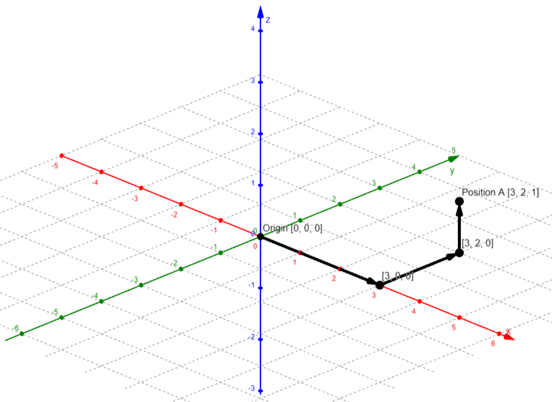

# Math primer

Before we get into describing the virtual world of WebGL, we should make sure to learn or refresh some basic math principles that make it all possible. 

Please note that there are some differences between concepts used for regular mathematics and for WebGL's implementation. This material is focused on the former while the later will be introduced in following chapters.

### Coordinate systems

To describe where objects are in space, where they are in relation to each other and how big they are we usually use a coordinate system. A linear coordinate system has unit and dimensional properties. 

The dimensions correspond to how many different combinations are possible to make with positions in the given space and are usually referred to by canonical variables `x`, `y`, `z` and so on.

There are infinitely many points in the other corresponding dimensions for a single point on one dimension. For example, in a two dimensional space, for constant `x = 1` there are indifinitely many points to choose from on the `y` dimension.

If first dimension can be represented by a number line made up of every possible point, the two dimensional space would be a coordinate plane made up of very possible line, and in three dimensional space there would be a volume made up of every possible plane. Dimensions above the third are hard to visualize, but the pattern continues and the logic will generalize to an n-dimensional space.

> 
>
> ***3D coordinate system***
>
> *Source: Custom*

In this material we will also asume that all coordinate systems use the same units. Therefore a movement of one step along one dimension and one step for another dimension in a rotated system (meaning that one dimension would became another) will correspond.

### Position

To describe a spacial location of an object, we always use a position in relationship to something else. This point of reference can be anything, but requires further knowledge of its location. To simplify description of all objects in a scene, a global origin is defined most of the times. In a 3D coordinate system this would typically be `[0,0,0]` (which means `x=0`, `y=0`. `z=0`).

In addition, every object will also have a local origin from which positions relative to that object (pieces of the object) are referenced. For example, a cinema room can have a projection screen as local origin, which is then used to locate individual seats inside the room.

Each object in a scene is positioned by specifying the relationship between its local and global origin. A position is then always a relation between two points. A description of location in n-dimensional space using an origin point always requires at least two types of information: distance and direction. 

We could specify the location of an object by saying *"x units from origin"*, but there are many or infinite number of points with the same specification - in 2D space this would essentially compose a circle. Therefore, to specify a unique location, we also need a line of reference from which we measure distances. We can then measure the distance from one or more reference lines that determine the direction. 

Also note that the direction can be provided in form of a negative distance - in our representation this means to travel along line of reference but in the opposite direction. There are multiple ways to go from the origin to the goal location, such as going directly along reference lines, using angles to reference lines with distance, working with a vector and others.

> 
>
> ***Position through reference lines***
>
> *Source: Custom*

> 
>
> ***Position through angles and distance***
>
> *Source: Custom*

> 
>
> ***Position through vector***
>
> *Source: Custom*

---

## Resources
| Title | Author | Link |
| :---   | :---  | :---  |
| Intuitive Math | [Sam Spilsbury][E001] | [Link][E001] |
| Modeling Location | [Dr. Wayne Brown][A006] | [Link][L006] |

<!-- Resource links -->
[L006]: http://learnwebgl.brown37.net/model_data/model_points.html (Modeling Location)
[A006]: https://http://learnwebgl.brown37.net/acknowledgements/author.html (Dr. Wayne Brown)

<!-- Extra links -->
[E001]: https://www.intuitive-math.club/ (Intuitive Math)
[E002]: https://github.com/smspillaz (Sam Spilsbury)
