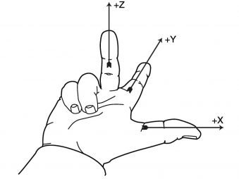
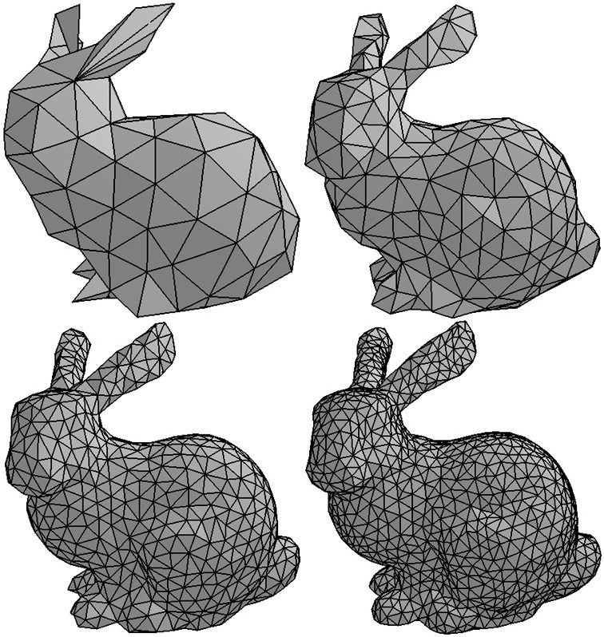
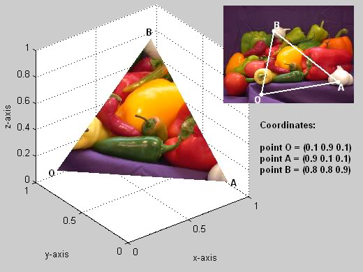

# Model data

To effectively describe and discuss base principles for WebGL development, we need to define individual elements it consists of. This material will guide us through its virtual world and model properties of each object in it, such as:

  - location: where is an object in reference to the scene
  - orientation: which way is the object turned or facing
  - volume: what 3D space does the object take up
  - surface: what color and structure is the object

As WebGL is a math-based tool, the description of the world will be in mathematical values, symbols and operations that a computer is capable of manipulating and rendering. Please, feel free to visit previous chapter to refresh or understand better some underlying logic.

### Location

Location is always in relationship to something else. This point of reference can be either *a global origin*, indicating a unique locatiion in a scene from which all objects are located, or *a local origin* from which locations relative to that point/object are referenced. Objects in a scene are positioned by specifying the relationship between their local origin and the scene's global origin.

To specify a unique location we use a coordinate system, which allows us to describe a position in any dimensional space through methods like going along lines of references, using angles and distances, or drawing vectors. For 3D space WebGL, same as most engineers and mathematicians, uses a right-handed Cartesian coordinate system. The first two axes are depicted as horizontal with the third axis pointing up.

> 
>
> ***Right hand rule***
>
> *Source: [Design and Software International](https://dsi-mfg.com/right-hand-rule/)*

WebGL describes a location in homogeneous coordinates, which is a 4-component value `(x, y, z, w)`. The first three values are distances along the axes of the coordinate system. The last value `w` is used for perspective calculations, which will be described later. When creating models in WebGL programs, it can sometimes save memory by storing and specifying only the values you care about and letting WebGL fill in the other values. This is especailly useful in 2D graphics rendering, where the `z` value is omitted and automatically set to zero. For normal 3D models, the program will store three floating point values for each point. The `w` component will not be stored and always set to `1.0`. 

### Orientation

While the location tells us where an object is in relationship to an agreed frame of reference, its orientation is equally important. Direction can be either:

  - relative: directions are in relationship to an object's current location and orientation (meaning from the POV of the object)
  - absolute: directions are relative to a fixed frame of reference and always point in the same direction regardless of their location

The standard tool for direction representation are vectors. In WebGL they are extensively used for model descriptions and object motion. Depending on space dimensionality, they are represented by multiple component values using floating point numbers - for example as `<dx, dy, dz>` in 3D space. Similarly to coordinates, individual component values can be omitted in some cases to safe memory.

A vector can be manipulated to change its directon and length. Some of manipulations that make physical sense are:

  - rotation: change vector's direction
  - scaling: change vector's length
  - normalization: keep vector's direction unchanged but change its length to 1 unit
  - addition: create vector representing a direction that is the sum of the originals
  - subtraction: create vector representing a direction that is the difference of the originals
  - addition/substraction of a vector to a point: create a new point at a new location

### Volume & surfaces

Objects in space take on an infinite variety of shape and forms. An object might be a square, cube, sphere, plane, complex blob or something completely different. To describe each of these objects in a unique way, it would require a special rendering algorithm for each one. In order to define any type of object regardless of the complexity of its form, we use triangles.

A triangle is the simplest geometric shape that defines an enclosed area, having an inside and an outside area. It is always planar, defining a flat surface and also dividing 3D space into three distinct regions. All 3 points lie in the plane defined by the triangle and also simultaneosly are on both sides of that plane. It is also always convex and impossible to be concave, which would be harder to render. These properties make the rendering process straightforward and fast, enabling realtime 3D graphics.

While almost any 3 points in space can be used to define a triangle, there are two cases that must be looked out for. Three points that are on top of each other or along a line do not define an enclosed area or divide 3D space into 3 regions. These are called *degenerate cases* and cause the mathematics that manipulate the triangles to fail.

The three points of a triangle define its edges or boundary line segments. Points where these segments intersect are called vertices. A tringle has a front side and a back side, also called *faces*, which are defined as the surface of a triangle that is enclosed within its edges. Only one face is visible to a viewer or camera at a time. The order of triangle's verices, called the *winding order*, is used to determine which side of a triangle is the front side. The winding order type is dependent on the given rendering engine - a counter-clockwise winding order is used in WebGL to determine the front face.

> 
>
> ***Triangle winding order***
>
> *Source: [Christoph Michel][E002]*

The orientation of a triangle can be determined through a *normal vector* or just *normal*. It is a vector at right angle to every point inside the triangle, calculated by taking the vector cross product of any two edges of the traingle. There are two such vectors, one for each of triangle's faces, pointing in the exact opposite direction. To calculate the normal vector for the front face, we take the cross product of edge 1 (between vertices 1&2) and edge 2 (vertices 2&3) for in a counter-clockwise winding order.

The normal vector can be calculated on the fly or calculated once and stored with the traingle's definition. If the normal is calculated as needed, the computing unit has to do operations every time the triangle is rendered. If the normal is stored with the triangle definition, more memory is required to store each triangle. The stored pre-calculated normal is always normalized to unit length to minimize calculation difficulty needed during repeated rendering. There is never a need to store both the front and back facing normal vectors since to get the second one we just need to multiply the vector with -1.

The form of any 3D object can be approximated with a set of triangles called a *triangle mesh*. The precision of object's representation is based on the number of triangles used to model it. Use of a minimal number of triangles will result in a very rough approximation with fast rendering and low hardware requirements while use of many triangles will bring much more accurate model with longer rendering and higher hardware requirements.

> 
>
> ***Triangle mesh quality***
>
> *Source: [Dr. Wayne Brown][A006]*

A triangle mesh defining a solid object will have only some of its triangles visible from particular point of view. If the density of the triangles is uniform over the entire surface of the object, then only half of a model's triangles will be visible at a time. To determine if a triangle is visible, calculate the angle between a vector pointing in the direction of the camera's view and a triangle's normal vector. If the angle is greater than 90 degrees, then the traingle's front face is oriented away from the camera and hidden by other triangles in the model that are facing towards the camera, if there are any. This test is called *face culling* and can potentially speed up the rendering process by a factor of two. It is also only available for models of solid objects that do completely enclose the interior of a model.

In WebGL there are multiple ways to generate triangles from a set of vertices:

  - `TRIANGLES`: Three vertices are needed for each triangle and each vertex is used for one triangle. Vertices that are used for more than one triangle must be repeated in the vertices array. Defining *n* triangles requires *3n* vertices.
  - `TRIANGLE_STRIP`: After the initial three vertices, each additional vertex defines one more triangle. Defining *n* traingles requires *(n+2)* vertices.
  - `TRIANGLE_FAN`: All traingles share the first vertex. After the frist two vertices, each new vertex creates one new triangle. Defining *n* traingles requires *(n+2)* vertices.

Dividing a mesh into the most efficient groups of these types is a complex problem. A considerable amount of memory can be saved by using `TRIANGLE_STRIP` and `TRIANGLE_FAN`, but they are actually rarely used. 

### Material properties

Surface properties of an object define what we see, from color and transparency, through its structure and shape, to light refraction and reflection. All these properties are essentially a question of how light reflects off of a surface into the view point. The surface will interact in different ways to different light sources. As developers, we need to model the interaction between the surface properties of an object and the properties of the light sources. Compared to the real world where there are almost always multiple light sources, we typically only try to approximate this using simplified assumptions.

For devices reproducing images by using light, such as electronic monitors, color is modeled as a combination of red, green and blue base colors. In this case, the light is additive, meaning adding all three base color at full intensity will result in white light, and the absence of these colors produces black. This is called RGB color system. For devices reproducing images from reflected light, such as printed pages, color is modeled as a combination of cyan, magenta and yellow base colors. These pigments absorb certain wavelengths of light and essentially reflect red, green and blue light. This color system is called CMY, or CMYK with separate black pigment to get crisper black colors.

WebGL programs typically use RGB format with floating point values in order to execute correctly in cross-platform environments. For example, `(0.45, 0.23, 0.89)` represents a color that has 45% red, 23% green and 89% blue. In total, this allows approximately for six hundred quintillion possible colors (that's a number six followed by 20 zeros). Of course, human eye can see much lower number of different variations of any particular shade of color. For most people, a 8-bit color depth provide a smooth progression of color.

An opaque object reflects almost all of the light that strikes it while a transparent object allows some light to pass through it. The amount of transparency can vary based on a composition of the object. Modeling transparency is very difficult, so a very simple approach for transparency is to store a percentage of opaqueness with a color value called *alpha value*. The RGBA color system stores 3 values for RGB colors and one alpha value. For example, `(0.45, 0.23, 0.89, 0.75)` makes 25% of the light pass through the object, since it is mostly opaque. If the alpha value is omitted, WebGL assumes it to be 1.0 (fully opaque).

The surface of real-world objects are rarely a solid color. To model many colors over a surface we *texture maps*. In mathematics, mapping is a function that converts a set of inputs into an output value. This can be either calculated from the inputs or looked up in a list of possible values. The output of a mapping is often a pattern, which is in computer graphics referenced as a texture map, allowing us to assign a different color to every pixel of a model face.

There are two kinds of texture maps, procedural and image. A procedural texture map is a function that converts input values into a color using a calculation. The results of the calculation are used to select a color from a list or create a new one. For image texture maps, a color value is typically looked up in a table from an image template. Compared to procedural maps, which can be multidimensional, an image only provides a 2D array of color values. 

Since images are always rectangles and WebGL only renders triangles, the program requires a location specifications. *Texture coordinates* declare which location in an image corresponds to a traingle's vertices. In order to be independent of object and image sizes, the locations are specified in percentages. Once the three defining vertices are mapped to corresponding locations in the image, the interior is calculated. It is important to assign coordinates that do not distort the image.

> 
>
> ***Image texture coordinates***
>
> *Source: [Dr. Wayne Brown][A006]*

When modelling how light interacts with the surfaces of an object, one or more of the following things happen when light strikes it:

  - The light reflects and goes off in a different direction based on the surface properties of the face
  - The light is absorbed by the object and converted into energy which heats up the object over time
  - The light travels through the object *(transparency)* and continues on at a different trajectory *(refraction)*
  - The light enters the object, bounces inside the object and then leaves it at a different place than it hit *(subsurface scattering)*

In the real world light comes from light sources, including sun, various lamps, spot light, fires and explosions. The characteristics of light changes based on its source, and our job is to model some of its basic properties:

  - Position
    - Directional: the light source is so far away that all light rays are basically traveling in the same direction
    - Positional: the light source is inside the scene and angle of the light striking an object is based on their relative position
  - Color
  - Form: does the light travel in all directions or is it restricted to a specific direction

Sometimes the source of the light in a scene is not entirely known, for example, objects in a dark room can be slightly visible, but you might not be sure if the light is coming from the moon, from a light in another room under a doorway etc. Light that is not coming directly from a light source and is just bouncing around in a scene is called *ambient light*. Ambient light illuminates every face of a model, therefore both the faces that get direct light and the faces hidden from direct light are illuminated with the same amout of ambient light. The amount of ambient light determines the overall light in a scene.

---

## Resources
| Title | Author | Link |
| :---   | :---  | :---  |
| Modeling Location | [Dr. Wayne Brown][A006] | [Link][L006] |
| Understanding front faces - winding order and normals | [Christoph Michel][E002] | [Link][E001] |

<!-- Resource links -->
[L006]: http://learnwebgl.brown37.net/model_data/model_points.html (Modeling Location)
[A006]: http://learnwebgl.brown37.net/acknowledgements/author.html (Dr. Wayne Brown)

<!-- Extra links -->
[E001]: https://cmichel.io/understanding-front-faces-winding-order-and-normals (Understanding front faces - winding order and normals)
[E002]: https://cmichel.io/ (Christoph Michel)